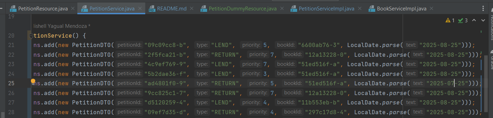

# TechSkillLab-L2-Desafio2
Código base para el desarrollo práctico de la clase #2 y su correspondiente desafío.

## Simulación Desafio # 2

Escenario 1: existen peticiones de hace mas de 3 días, por lo que debe
             lanzarce un mono.error(). En este caso se hace un reintento,
             el cual tambien falla. Se muestra el dato cambiado:

             Finalmente se captura la excepción con onErrorResume()

Escenario 2: No existen petinciones de hace mas de 3 días,por lo que se emiten
             todas las peticiones RETURN. Ademas, no superan el timeout definido de 
             5 SEGUNDOS. Finalmente se imprimen los datos usando un doOnNext() y se usa 
             delayElements() para imprimir los elementos con cierto delay

             La respuesta en swagger

             La respuesta en consola. Bajo este escenario, no hay lugar a reintentos ni lances de error

Escenario 3: En caso de que las peticiones RETURN no sean emitidas en un
tiempo de 500 milisegundos, habra 1 reintento,y se capturará la excepción 
a traves de onErrorResumme(). En este caso, los datos se emiten pero por encima de
los 500 ms, por lo que se propaga el timeout luego del retry()

Escenario 4: Cambiaremos una petition que tenga mas de 3 días

             Luego, enviaremos multiples peticiones que siempre desencadenaran un error
             de esta manera el estado del circuitBreaker es Closed y generará una excepción
            onErrorResume(). En este caso, el retry tambien generará errores
                

            

            

            